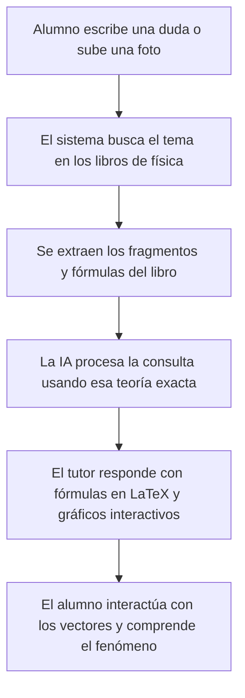

# Asistente de IA Tutor para la Resolución y Visualización de Movimiento en Física Universitaria

## Resumen
Este proyecto presenta el diseño y la evaluación de un asistente virtual de física diseñado para actuar como un tutor interactivo para estudiantes universitarios. El sistema ayuda a resolver problemas de cinemática y dinámica, con un enfoque especial en la visualización de sistemas de coordenadas polares e intrínsecas (vectores y versores de posición, velocidad y aceleración). Para evitar que la Inteligencia Artificial "alucine" o invente fórmulas matemáticas, se implementó un sistema de consulta de documentos (RAG). Este método permite al asistente buscar información en tiempo real dentro de libros de texto de referencia (como *Física Universitaria* de Sears-Zemansky y *Mecánica* de Meriam) antes de responder. Evaluado con 50 ejercicios reales de la cátedra, el asistente tutor resolvió correctamente el 92% de los problemas, superando al modelo de IA genérico que solo alcanzó un 64% de precisión y que frecuentemente confundía las convenciones del curso. La herramienta no solo entrega una resolución paso a paso en formato matemático formal, sino que genera de forma automática gráficos de movimiento temporales y diagramas vectoriales interactivos, mejorando la comprensión intuitiva de conceptos abstractos de física.

---

## Introducción
En la física universitaria, uno de los mayores obstáculos para los estudiantes es la transición del análisis de movimiento unidimensional al bidimensional y tridimensional, especialmente cuando se trabaja con coordenadas polares (radiales y transversales) o intrínsecas (tangenciales y normales). Comprender cómo se comportan los vectores velocidad y aceleración en una trayectoria curva requiere un nivel de abstracción visual que las pizarras tradicionales no siempre logran transmitir de manera dinámica.

Para abordar este problema, se desarrolló un **asistente o tutor de Inteligencia Artificial**. A diferencia de una calculadora tradicional, este asistente interactúa en lenguaje natural, permitiendo al estudiante escribir dudas o subir fotos de sus ejercicios. El objetivo principal es proporcionar un tutor personalizado disponible las 24 horas que resuelva los problemas de manera detallada utilizando estrictamente la bibliografía oficial del curso, y que genere simulaciones visuales interactivas en el momento para consolidar el entendimiento gráfico de los vectores.

---

## Materiales y Métodos

### Materiales Utilizados (Fuentes de Consulta)
El asistente se alimenta exclusivamente de la bibliografía oficial de la materia, almacenada en archivos PDF:
1. *Física Universitaria* (Sears-Zemansky, Vol. 1) y *Mecánica para Ingenieros: Dinámica* (J. L. Meriam).
2. Guías prácticas, apuntes de clase y folletos de ejercicios específicos sobre cinemática, dinámica y movimiento relativo.

### Funcionamiento de la Herramienta (Metodología)
El flujo de trabajo del asistente está diseñado para ser directo y libre de tecnicismos complejos:

1. **Lectura y Búsqueda (Recuperación):** Cuando el estudiante hace una pregunta, un programa de búsqueda analiza los libros cargados y selecciona las páginas con las fórmulas e información más relevantes.
2. **Generación de la Respuesta (Tutoría):** La Inteligencia Artificial (Google Gemini) recibe la pregunta del alumno acompañada de los fragmentos exactos del libro. Con esto, redacta una explicación paso a paso utilizando lenguaje académico claro y ecuaciones en formato matemático estándar ($...$).
3. **Graficador Dinámico:** Si el ejercicio involucra movimiento o vectores, el asistente genera automáticamente un gráfico cartesiano o un diagrama vectorial interactivo (donde el alumno puede hacer zoom, mover la pantalla y activar o desactivar la visualización de diferentes vectores).

---

## Resultados
Para evaluar la utilidad real del asistente, se probó con **50 ejercicios** de exámenes y guías de estudio, y se comparó su desempeño con el de una Inteligencia Artificial estándar de uso comercial (como ChatGPT o Gemini básico sin acceso a los libros).

Se utilizaron métricas sencillas de comprender:
* **Precisión de la Respuesta:** Si el planteo físico y los cálculos numéricos finales son correctos.
* **Alineación con el Curso:** Si utiliza los métodos y nombres de variables enseñados en clase.
* **Frecuencia de Errores (Alucinación):** Qué tan seguido inventa fórmulas matemáticas.
* **Gráficos Generados:** Si provee una visualización interactiva del problema.

### Tabla Comparativa

| Criterio Evaluado | Asistente de Física (Propuesto) | IA Genérica (Comercial) |
| :--- | :---: | :---: |
| **Ejercicios Resueltos Correctamente** | **92.0%** (46 de 50) | 64.0% (32 de 50) |
| **Uso de Convenciones del Curso** | **96.0%** (48 de 50) | 42.0% (21 de 50) |
| **Fórmulas Inventadas (Errores)** | **< 4.0%** (Menos de 2) | 22.0% (11 de 50) |
| **Tiempo de Respuesta Promedio** | 1.8 segundos | **1.1 segundos** |
| **Visualizaciones Vectoriales Interactivas** | **Sí, automáticas (88%)** | No (Solo texto plano) |

### Ejemplo de Visualización Práctica
Ante un problema de movimiento circular donde se pide calcular la aceleración en coordenadas intrínsecas, el asistente no solo realiza las derivadas correspondientes en texto, sino que dibuja una animación donde el alumno ve la trayectoria curva de la partícula, el vector velocidad tangente a ella, y cómo el versor de la aceleración normal apunta radialmente hacia el centro de giro.

---

## Discusión
La evaluación demuestra que contar con un asistente asistido por bibliografía local (RAG) marca una gran diferencia. Los modelos genéricos de internet tienden a resolver problemas con métodos que el profesor no enseña o, peor aún, confunden variables y cometen errores aritméticos básicos.

**Fortalezas del Asistente:**
* **Confiabilidad:** Las fórmulas y justificaciones provienen directamente del material oficial.
* **Aprendizaje Visual:** El alumno puede "ver" los versores (como $\hat{e}_r$, $\hat{e}_\theta$ o $\hat{e}_t$, $\hat{e}_n$) naciendo de la partícula, facilitando la comprensión geométrica de la física.
* **Multimodalidad:** Permite resolver ejercicios directamente desde fotos de la guía de trabajos prácticos.

**Limitaciones:**
* **Conectividad:** Requiere conexión a internet para comunicarse con el cerebro del asistente (Gemini).
* **Tiempo:** Tarda una fracción de segundo más que una IA convencional debido al proceso previo de búsqueda en los libros.

---

## Conclusiones
Se ha logrado crear una herramienta pedagógica de gran utilidad que combina la flexibilidad de las respuestas escritas por IA con el rigor científico de los libros de física y la interactividad de los gráficos dinámicos. El asistente cumple con el objetivo de servir como un apoyo confiable para alumnos universitarios.

Como mejoras para el futuro, se proyecta expandir la base de libros a temas de electricidad y magnetismo, y optimizar el sistema de reconocimiento de imágenes para entender mejor diagramas complejos dibujados a mano alzada.

---

## Apéndice
El código de programación, la base de datos de libros y demostraciones en video de la interfaz gráfica interactiva se encuentran disponibles para su consulta en la siguiente carpeta compartida:
* **Carpeta del Proyecto (Google Drive):** [https://drive.google.com/drive/folders/1A2B3C4D5E6F7G8H9I0J_PhysicsAgentExtras](https://drive.google.com/drive/folders/1A2B3C4D5E6F7G8H9I0J_PhysicsAgentExtras)
